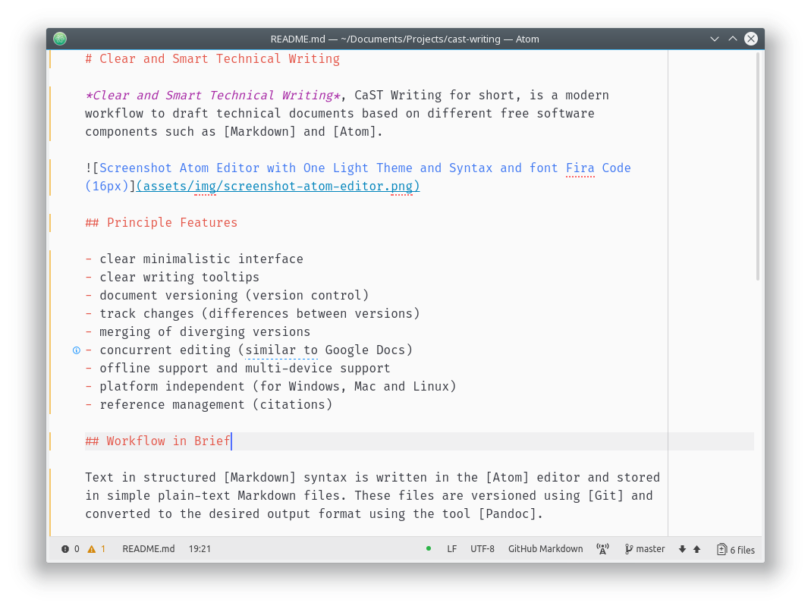

# Clear and Smart Technical Writing

*Clear and Smart Technical Writing*, CaST Writing for short, is a modern workflow to draft technical documents based on different free software components such as [Markdown] and [Atom].

## Principle Features

- clear minimalistic interface
- clear writing tooltips
- document versioning (version control)
- track changes (differences between versions)
- merging of diverging versions
- concurrent editing (similar to Google Docs)
- offline support and multi-device support
- platform independent (for Windows, Mac and Linux)
- reference management (citations)

## Workflow in Brief

Text in structured [Markdown] syntax is written in the [Atom] editor and stored in simple plain-text Markdown files. These files are versioned using [Git] and converted to the desired output format using the tool [Pandoc].

[Markdown]: https://en.wikipedia.org/wiki/Markdown
[Atom]: https://en.wikipedia.org/wiki/Atom_(text_editor)
[Git]: https://en.wikipedia.org/wiki/Git
[Pandoc]: https://en.wikipedia.org/wiki/Pandoc
